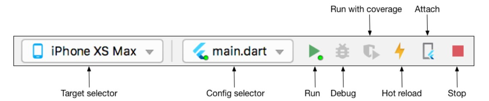
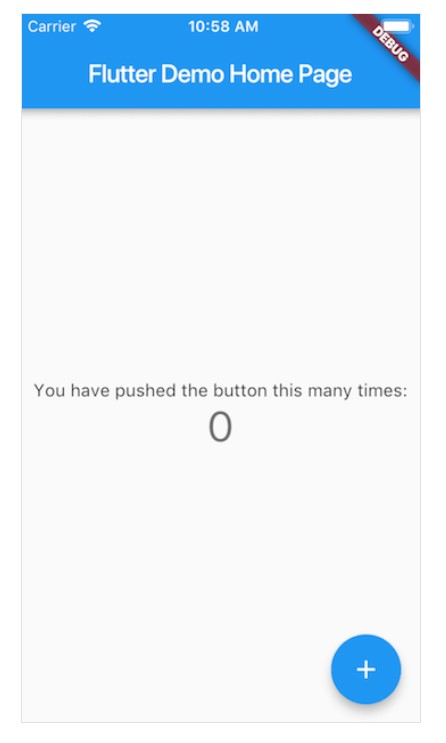

# Flutter
Flutter是谷歌的移动UI框架，可以快速在iOS和Android上构建高质量的原生用户界面。  
## 优势
- 使用热重载技术，修改后应用界面可立即更新。  
- 用户界面有多种选择，美观且便捷。  
- API功能强大，配合Flutter的响应式框架与基础widget可便捷地自定义UI。  
- 一个免费且开源的移动应用程序SDK。
- 一份代码可以同时生成安卓与IOS两个平台的应用，兼容排版、图标等各方面差异。  
## 核心特性 - 一切皆为widget
Flutter具有一致的统一对象模型：widget，即Flutter应用程序用户界面的基本构建块。  
Widget本身通常由许多更小的、单一用途widget组成，这种层次结构组成了整个界面。  
类层次结构很浅且很宽，可以最大限度地增加可能的组合数量，您还可以通过与其他widget组合来控制widget的布局。  
可以通过实现widget的build来返回widget树，从而定义widget的独特特征。  
当widget需要在运行过程中被更改时，称widget有状态。当状态改变时，widget需要重新被构建从而使UI得到更新。  
## 缺点
- 开发人员需要具备原生（安卓+IOS）代码基础开发能力。
- 提倡widget的组合，对初学者不友好。
- widget的选择困难。
## Hello-World
创建一个新的Flutter项目（需要先安装SDK）。  
以Android Studio为例，在工具栏中选择启动按钮：  

  

看到如下界面，则启动成功。  
  

[Flutter英文文档](https://flutter.dev/docs)